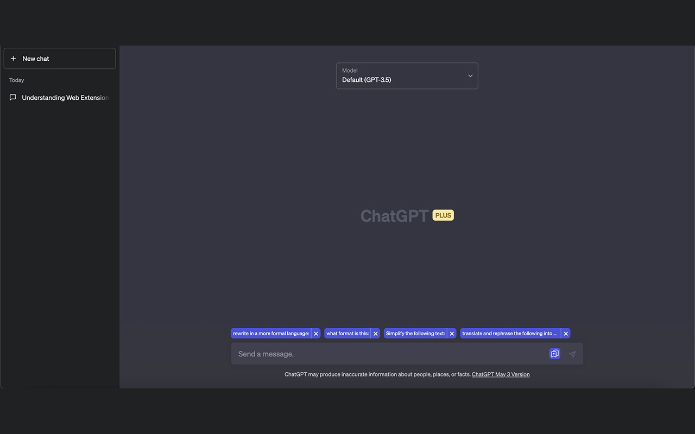

# ChatGPT Snippets

ChatGPT Snippets is a Chrome extension designed to improve your productivity and streamline your interactions with OpenAI's ChatGPT. This tool allows you to save and quickly access your frequently used phrases or favorite responses, all within the context of your ChatGPT sessions.

## Features

- **Save Snippets**: Save important or frequently used texts for future use.
- **Instant Access**: Click on a saved snippet to insert it directly into the chat field.
- **Manage Snippets**: Add or remove snippets as needed.
- **Privacy-Focused**: All data is stored locally, ensuring your snippets stay with you.

## Usage

1. Start a session with ChatGPT at `https://chat.openai.com/*`.
2. Type your text into the ChatGPT input field.
3. Click the save button to store the text as a snippet.
4. Click on a saved snippet to insert it into the input field.

## Installation

1. Clone this repository: `git clone https://github.com/maslaknikolai/chatgpt-snippets.git`
2. Open the Extension Management page by navigating to `chrome://extensions`.
   - Alternatively, open this page by clicking on the Chrome menu, hovering over More Tools then selecting Extensions.
3. Enable Developer Mode by clicking the toggle switch next to Developer mode.
4. Click the LOAD UNPACKED button and select the cloned directory.

## Contributing

Pull requests are welcome. For major changes, please open an issue first to discuss what you would like to change.

## License

[MIT](https://choosealicense.com/licenses/mit/)
